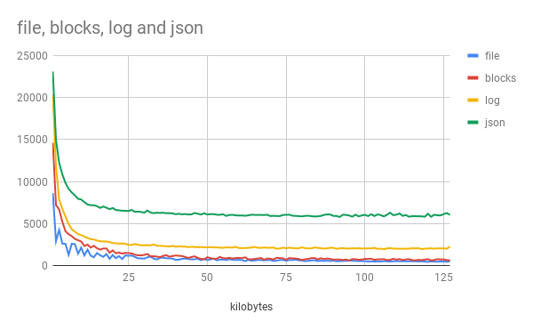
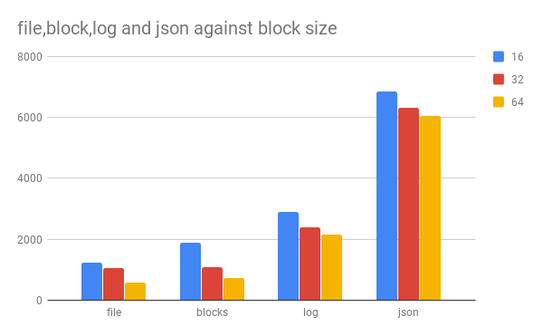
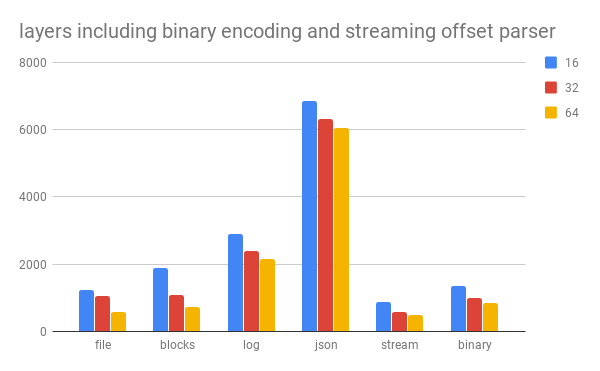

# bench-flumelog-offset

benchmark the different layers in flumelog-offset to see where performance problems are.

## Method

I took a large file (in this case, my secure scuttlebutt local log, size: 343 Mb) and scan it
with various methods, varying blocksize. (and applying various levels of parsing)

* `file`: read each block at givin size from start to end.
* `blocks`: read 1k sections of each block. (note: this simulates reading messages since this is close to the average size of ssb messages, except it should be faster, because 1k reads will never overlap)
* `log`: read every record via `flumelog-offset`, but do not parse into json.
* `json`: same as `log`, except parse into json.

The Y-axis is in milliseconds, time to read 343 mb file, lower is better.

## results

We see here that for all layers, blocksize has a significant effect on performance.
although the effect has diminishing returns. 64kb seems like a good default.

here we compare just a few block sizes, to better show the relationship between
the layers. The first thing to note is that the later layers add more overhead
than the difference created by blocksizes. Next to the time taken by JSON parsing,
blocksize makes very little difference. However, at the lower layers, the effect
of blocksize is strong, 64kb blocks are read twice as fast as 16k blocks!

But most important: I think `log` could be much faster. It should be possible
to get `log` to perform closer to `blocks`. Also, I've recently been exploring
the idea of a [in-place binary encoding](https://github.com/dominictarr/binary)
(this is designed to not need parsing, so that a single property can be read,
or path followed into the data without processing the entire record)

This is just at the proof of stage, but compared to the current implementation,
performance is very promising!

## License

MIT

